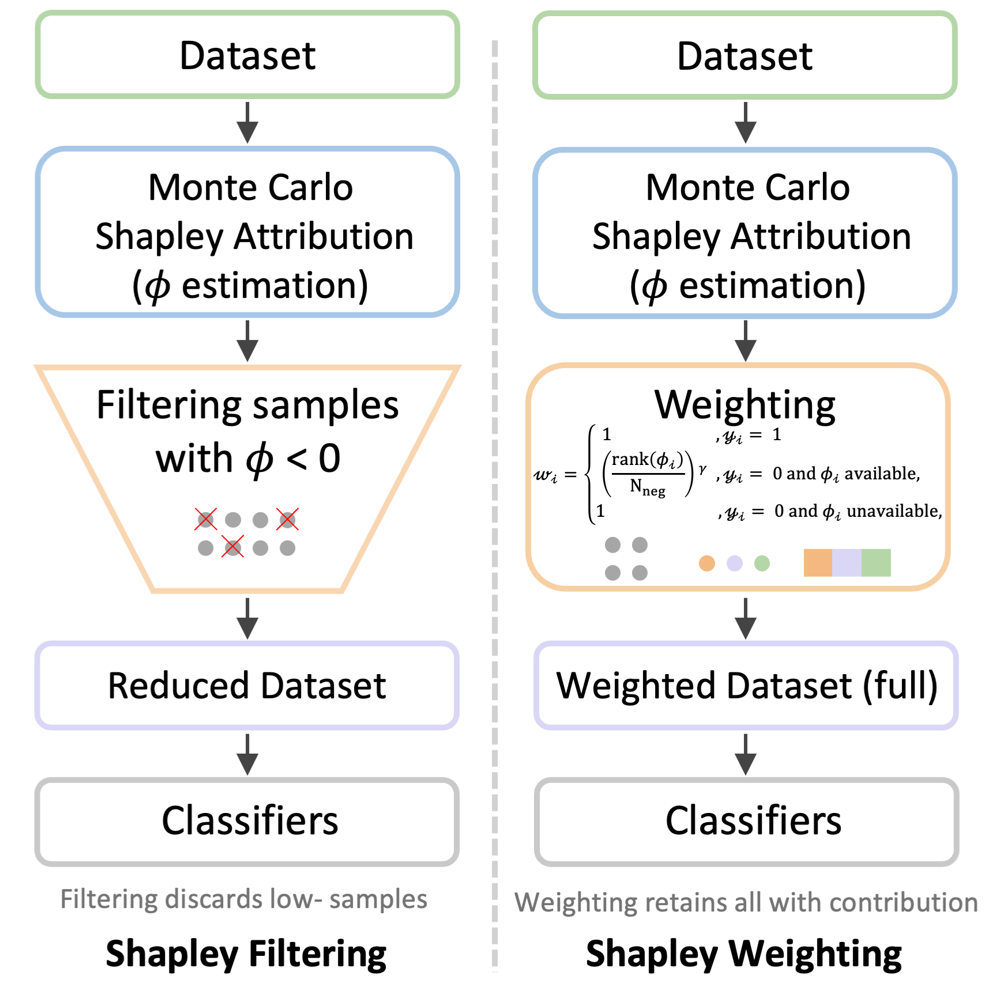

# Shapley Weighting Reference Implementation

This repository provides a reference implementation of Shapley Weighting (SW) from our PAKDD 2026 special session paper, "Towards A Novel Shapley Based Framework for Data Centric Cohort Refinement". The code is intentionally lightweight. It is designed to illustrate the core algorithmic components in a self contained way and to run on a public or synthetic dataset without credentialed access data.

This repository does not aim to reproduce the full MIMIC IV, MIMIC III, or eICU experimental pipeline reported in the paper. Those datasets require credentialed access and the full study uses a larger preprocessing and evaluation setup.

## Method at a glance

The following figure summarizes the key difference between Shapley Filtering and Shapley Weighting. Shapley Filtering removes samples with negative estimated contribution, while Shapley Weighting retains all samples and adjusts influence through rank based weights.




## Environment

The recommended setup uses conda with Python 3.9.

Create the environment.

```bash
conda env create -f environment.yml
conda activate sw-refimpl
```

If you prefer pip, you can install the minimal dependencies with the provided requirements file.

```bash
python -m venv .venv
source .venv/bin/activate
pip install -r requirements.txt
```

## Quickstart

Run the toy demonstration script.

```bash
python examples/demo_synthetic.py --utility roc --gamma 0.5 --mc 2
```

The script prints a short three fold summary that compares vanilla training, a Shapley filtering baseline, and Shapley weighting.

## Repository structure

The repository is organized as follows.

src/shapley_weighting/shapley.py
Implements negative only Shapley value estimation using a Monte Carlo permutation estimator. It uses a lightweight logistic regression base model and supports early stopping based on inner validation utility.

src/shapley_weighting/weighting.py
Implements the rank to weight mapping used by Shapley Weighting. It converts Shapley values to ordinal ranks, maps ranks to sample weights with exponent gamma, clips and normalizes weights, and reports effective sample size diagnostics.

src/shapley_weighting/models.py
Defines simple model builders used by the demo. The current demo uses logistic regression for clarity.

examples/demo_synthetic.py
Runs a complete end to end demonstration on a synthetic imbalanced classification dataset. It follows the same high level flow as the paper. It builds an inner split, estimates negative Shapley values, computes rank based weights, and trains a weighted classifier. It also includes a small baseline that demonstrates a Shapley filtering style removal rule.

requirements.txt
Lists the minimal Python packages required to run the reference implementation.

environment.yml
Provides a conda environment specification targeting Python 3.9.

## Method overview

The demo follows the same conceptual pipeline as the paper.

First, the outer training set is split into an inner training subset and an inner validation subset.

Second, Shapley values are estimated for negative samples only using a lightweight base model and a Monte Carlo permutation estimator. The inner validation metric is chosen by the utility option.

Third, Shapley values are converted to ranks, and ranks are mapped to sample weights. Positive samples use unit weight. Negative samples receive rank based weights controlled by gamma.

Finally, a downstream classifier is trained using sample weights. The resulting predictions are evaluated using standard discrimination and calibration metrics.

## Citation

If you use this code, please cite the PAKDD 2026 paper.

## License

MIT
